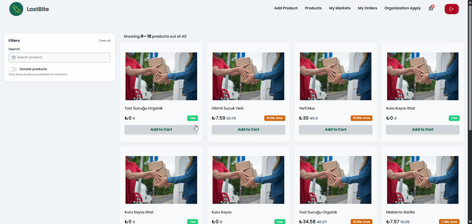
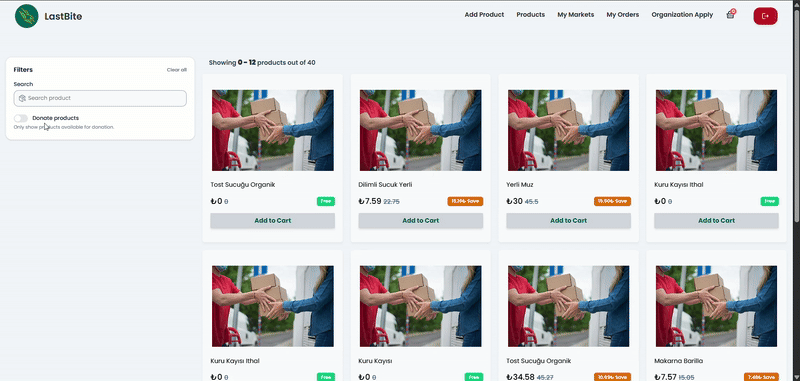

# LastBite — A Sustainability-Driven Food Waste Reduction Platform

## 🚀 Overview
LastBite is a sustainability-focused platform that helps reduce food waste by allowing **supermarkets and users** to upload near-expiry products either as **donations** or at **discounted prices**.  
Other users can purchase these discounted products at lower cost, while organizations can access donated items for free.  

This project was developed as my graduation project, combining **real-world problem solving (food waste reduction)** with **modern web technologies**.  

🛠️ Development Status

⚠️ Note: The front-end part of the project is not fully completed yet.

- Products are currently using the same image.

- There are some design gaps and improvements to be made.

- New updates will be added in upcoming commits.

---

## 🧩 Features
- **Product Upload:** Supermarkets and users can add products to the platform as donations or discounted listings.  
- **E-Commerce Workflow:** Users can search products, apply filters, add items to a cart, and complete orders just like in a standard e-commerce system.  
- **Donation System:** Organizations can directly access and claim donated products for free.  
- **Search & Filtering:** Advanced filtering by product type, expiry date, and uploader (supermarket/user).  
- **Role-Based Access Control (RBAC):** Different experiences for users, supermarkets, and organizations.  
- **Responsive & Accessible UI:** Built with reusable components, responsive layouts.  

---

## 🏗️ Technologies
- **Frontend:** React, TypeScript, Redux Toolkit, TailwindCSS  
- **State Management:** Redux Toolkit (slices, async thunks)  
- **API & Data Handling:** REST APIs, Axios  
- **Other Tools:** ESLint, Prettier 

---

## 📸 Screenshots

### 👤 USER SIDE 

- 🛒 **Product List**  
  Products are listed with their prices and can be added to the cart. 

- 🔍 **Elastic Search and Filters**  
  Users can search for specific products and, if desired, filter the results to show only those that are free.  

- 🛒 **Cart Update – ✅ Order Creation**  
  Users can update product quantities in the cart, remove items if needed, view applied discounts and the total payable amount, and finally create an order. The product stock is also updated automatically when an order is placed.   

- 📑 **My Orders**  
  Users can view their previous orders, check the details of each order, and access the invoice.  

-  🏬 Market Creation

- ➕ **Markets and Add Product**  
  Users can add products to their markets, view all listed products, and see the number of items sold. 

- 🏢 **Organization Application**
-   A user with the *user* role can apply to become an organization. The application goes to the admin for approval. Once approved, the user becomes an organization and gains access only to free products.  

### 🛡️ Admin Side

- ✅❌ **Organization Applications (Approve / Reject) & View Organizations**  
  The admin can review incoming organization applications, approve or reject them, and view the list of existing organizations.  

  

### 🏢 Organization Side

- 🛒 **View Products**  
  When an organization logs in, clicking on the products shows only those with a price of 0.  

  

- 📑 **Order History & Invoice Download**  
  Organizations can view their past orders and download the corresponding invoices.  

  
